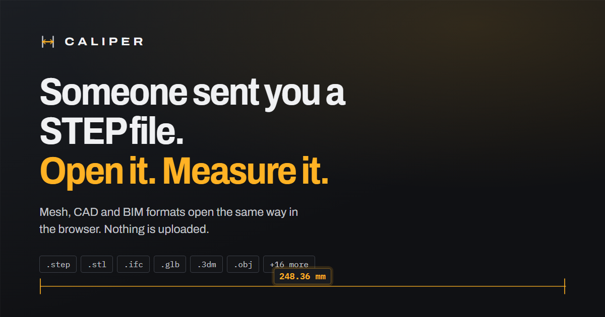

# Caliper

Open a 3D model in the browser and find out how big it is. The file is read and
rendered on the device, so nothing is uploaded and there is nothing to install.



**Version 1.0.0** — deliberately small. It opens models, shows their size, and
measures distances and diameters. That is the whole app. Everything else is on
the roadmap below rather than in the way.

## What it does

**Opens 22 extensions across three pipelines.**

| Pipeline | Extensions | How it reaches the screen |
| --- | --- | --- |
| Mesh | `stl` `obj` `ply` `off` `gltf` `glb` `fbx` `dae` `3ds` `3mf` `amf` `wrl` | Triangles are read straight out of the file |
| CAD B-rep | `step` `stp` `iges` `igs` `brep` `brp` `fcstd` `3dm` | Surfaces are tessellated on open by an OpenCascade kernel |
| BIM | `ifc` `bim` | Building elements arrive with their own geometry and grouping |

**Tells you the size.** Width, height and depth in the file's own units, plus
the diagonal, switchable between mm, cm, m and inches.

**Measures it.** Two tools:

- **Distance** — click two points. The readout also splits the span into X, Y
  and Z, which is usually the number you actually wanted.
- **Diameter** — click three points around a hole or a round edge and Caliper
  fits a circle through them.

Both snap. Every click tests the seven features of the triangle it hit — three
corners, three edge midpoints, the centroid — and locks onto whichever is
nearest *on screen* within 14 pixels, so a dimension lands on the feature you
were aiming at rather than wherever the ray happened to hit.

**Shows it properly.** Orbit, pan and zoom; shaded, wireframe or shaded with
edges; a build plate and a shadow so the model reads as an object rather than a
shape adrift; an orientation gizmo that tells you which way you are facing and
takes you to any of the six straight-on views. Click a part to select it. Save
the view as a PNG.

## Running it

```bash
npm install
npm run dev        # http://localhost:5173
npm run build      # -> dist/
npm run preview    # serve the build
npm run typecheck
```

Node 22 or newer (see `.nvmrc`, which pins 24). Node 20 reached end of life in
April 2026 and GitHub's runners have started warning about it.

## Branches and releases

| Branch | What it is |
| --- | --- |
| `main` | What is deployed. Only merge into it from `dev`. |
| `dev` | Where work lands. Feature branches merge here first. |

Every push and pull request on either branch runs **CI** — typecheck plus a
production build (`.github/workflows/ci.yml`). Pushing to `main` additionally
runs **Deploy**, which builds with the right base path and publishes to GitHub
Pages (`.github/workflows/deploy.yml`).

**Pages has to be switched on by hand once, before the first deploy:**
Settings → Pages → Build and deployment → Source → **GitHub Actions**.

The workflow passes `enablement: true` to `actions/configure-pages`, which asks
the API to create the Pages site if it is missing. That call needs repository
admin rights, and the `GITHUB_TOKEN` a workflow runs with does not carry them —
so on a repo where Pages has never been configured it fails with
`Create Pages site failed … Resource not accessible by integration`. The flag is
kept because it costs nothing once the site exists (the action finds it and
skips the create), and it does work for anyone with admin-scoped credentials.
But it is not a substitute for the one-time toggle.

Two other things worth knowing:

- GitHub only serves Pages from a **private** repository on a paid plan. On the
  free plan, make the repo public or deploy elsewhere.
- Netlify and Vercel are both already configured (below), serve private repos on
  their free tiers, and need none of the base-path handling Pages does. If you
  go that way, delete `.github/workflows/deploy.yml` so a red X stops appearing
  on every push to `main`.

Releases are tagged `vMAJOR.MINOR.PATCH` and written up in
[CHANGELOG.md](CHANGELOG.md). Bump the version in `package.json` and add the
changelog entry in the same commit as the release.

### Deploying somewhere else

The build is a static bundle, so any static host will serve it. Configs ship for
two:

- **Netlify / Cloudflare Pages** — `netlify.toml` plus `public/_headers`
- **Vercel** — `vercel.json`

Both set the single-page rewrite and the same security headers, including a CSP
that gives the WebAssembly kernels their origins and nothing else. The app will
not load its CAD or BIM kernels without `cdn.jsdelivr.net` and
`www.gstatic.com` in `script-src`.

Three things to change for your own domain: the `canonical` link and the
`og:image` URL in `index.html`, and the `loc` in `public/sitemap.xml`.

### Passing a model in by URL

```
https://your-host/?model=https://example.com/bracket.step
https://your-host/?model=/models/bracket.step&name=Bracket.step
```

Only `http` and `https` are followed. The remote host has to send permissive
CORS headers, or the fetch fails and the toast says so.

### Running fully offline

The CAD and BIM kernels are 5–12 MB WebAssembly builds fetched on first use, so
a visitor who only ever opens an STL never downloads them. To remove the CDN
dependency, copy each package's `dist` folder into `public/vendor/` and point
the constants in `src/lib/cdn.ts` at the local paths.

## How it is put together

```
src/
  viewer/           three.js, no React
    Engine.ts       camera, picking, render modes, measuring, screenshot
    Stage.ts        build plate, grid, lighting, theming
    Annotations.ts  measurement geometry, drawn as dimension lines
    Bracket.ts      the selection marker
    measure.ts      snapping and circle fitting
    analyze.ts      scene statistics and bounds
    loaders/        one module per pipeline
  store/            zustand; the single source of truth for anything the UI shows
  components/       React, no three.js
  hooks/            file drop, hotkeys, media queries
  styles/           tokens.css owns colour and type; ui.css owns everything else
```

The split is the load-bearing part: `viewer/` never imports React, and
`components/` never imports three.js. They meet at the store and at the handful
of hooks the Engine calls.

**Rendering is on demand.** Frames are drawn when something changes — the camera
moved, a setting changed — not sixty times a second regardless. When the frame
rate does drop under load, the renderer backs off its device pixel ratio rather
than staying beautiful and unusable, and climbs back when there is headroom. The
status strip says so when it happens.

**Render modes swap materials on the model's own meshes** rather than setting
`scene.overrideMaterial`, which would also repaint the build plate, the grid and
the selection marker.

## Colour

Three systems, and they never overlap:

- **Amber** is authorship — selection, measurements, primary actions. Anything
  amber is something you put there.
- **The axis triad** (X red, Y green, Z blue) is position — the gizmo, the size
  rows, the per-axis split of a distance.
- **Grey** is everything else.

Amber is not a taste decision. A model viewer has already spent red, green and
blue on the triad, and the triad is not negotiable because every other tool in
this world uses it; an emerald accent has to fight axis-Y for the same
wavelength and one of them loses. Amber never enters the argument. It also
happens to be the colour a scribed line takes on oiled steel, which is exactly
what a measurement is.

Every foreground/background pair in `tokens.css` clears WCAG AA against the
surface it sits on, in both themes.

## Keyboard

| Key | What it does |
| --- | --- |
| <kbd>Q</kbd> <kbd>W</kbd> <kbd>E</kbd> | Shaded, wireframe, shaded with edges |
| <kbd>1</kbd>–<kbd>6</kbd>, <kbd>0</kbd> | Front, back, left, right, top, bottom, isometric |
| <kbd>F</kbd> | Fit the model to the screen |
| <kbd>G</kbd> <kbd>S</kbd> | Build plate, shadows |
| <kbd>M</kbd> <kbd>D</kbd> | Measure a distance, measure a diameter |
| <kbd>Backspace</kbd> | Undo the last measuring point |
| <kbd>Esc</kbd> | Put the tool away, then clear the selection |
| <kbd>⌘O</kbd> <kbd>⌘S</kbd> | Open a model, save a PNG |
| <kbd>⌘B</kbd> <kbd>⌘J</kbd> | Details panel, theme |

## Roadmap

Deliberately left out of 1.0, roughly in the order they are worth adding:

- Angle measurement, and reading a single point's coordinates
- Section planes, for measuring internal features
- A scene tree with per-part hide and isolate, for assemblies and IFC models
- Exploded assembly views
- Animation playback for files that carry clips
- Export to GLB and STL
- Orthographic projection, for measuring without perspective foreshortening
- Lighting presets and surface colour

## Licence

MIT.
